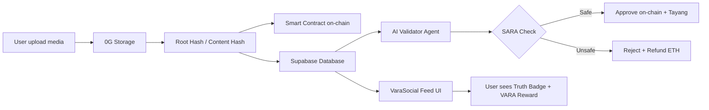

# VaraSocial — Pitch Deck

> **Web4 Social Platform** · Powered by 0G Decentralized Storage · Vara Network $VARA Rewards · AI Truth Scoring

---

## Slide 1 — Cover

**VaraSocial**
*The Truth-First Social Network for the Decentralized Web*

Sebuah platform media sosial generasi berikutnya yang menggabungkan:
- Kecerdasan buatan untuk validasi kebenaran konten
- Penyimpanan terdesentralisasi via 0G Storage
- Token ekonomi $VARA untuk kreator berkualitas
- Identitas berbasis wallet (Web4 / wallet-first)

> *"Bukan siapa yang paling viral — tapi siapa yang paling jujur."*

---

## Slide 2 — Masalah (The Problem)

### Media Sosial Hari Ini Rusak

| Masalah | Dampak |
|---------|--------|
| **Misinformasi viral** | Hoax menyebar 6× lebih cepat dari fakta (MIT, 2018) |
| **Kreator tidak terbayar adil** | Algoritma rewarding engagement bait, bukan kualitas |
| **Data pengguna dikuasai platform** | Tidak ada portabilitas, tidak ada kepemilikan nyata |
| **Moderasi konten tidak transparan** | Keputusan arbitrer tanpa akuntabilitas |
| **Identitas terpusat rentan** | Akun bisa dihapus sewaktu-waktu oleh platform |

### Angka yang Mengkhawatirkan

- **62%** konten viral mengandung informasi yang menyesatkan
- **$0** pendapatan rata-rata kreator kecil di platform Web2
- **100%** data pengguna dimiliki oleh perusahaan platform, bukan pengguna

---

## Slide 3 — Solusi (The Solution)

### VaraSocial: Platform Sosial Web4

VaraSocial adalah platform media sosial yang dibangun di atas infrastruktur terdesentralisasi dengan tiga pilar utama:

```
┌────────────────┐    ┌─────────────────┐    ┌──────────────────┐
│  AI TRUTH      │    │  DECENTRALIZED  │    │  TOKEN ECONOMY   │
│  SCORING       │    │  STORAGE        │    │  ($VARA)         │
│                │    │                 │    │                  │
│  Setiap post   │    │  Media disimpan │    │  Kreator jujur   │
│  diberi skor   │    │  di 0G Network, │    │  & viral dapat   │
│  0-100 oleh AI │    │  bukan server   │    │  reward $VARA    │
│                │    │  terpusat       │    │                  │
│  ✅ Valid       │    │  Hash on-chain  │    │  Langsung ke     │
│  ⚠️ Suspicious  │    │  via smart      │    │  wallet kreator  │
│  🔴 Hoax       │    │  contract       │    │                  │
└────────────────┘    └─────────────────┘    └──────────────────┘
```

---

## Slide 4 — Produk (Product Overview)

### Fitur Utama yang Sudah Dibangun

#### 1. Feed dengan AI Truth Badge
Setiap postingan secara otomatis mendapat label kebenaran:
- **Verified** (skor 70–100) — hijau, konten valid
- **Suspicious** (skor 40–69) — ungu, perlu verifikasi
- **Hoax** (skor 0–39) — merah, konten tidak akurat

#### 2. Virality Score
Sistem penilaian virality yang terpisah dari truth score — hanya konten berkualitas tinggi yang mendapat amplifikasi.

#### 3. $VARA Reward Display
Kreator melihat reward $VARA yang mereka hasilkan secara real-time. Pembayaran langsung ke wallet EVM.

#### 4. Mode Turu (AI Clone)
Fitur "tidur aktif" — ketika diaktifkan, AI agent merepresentasikan persona pengguna dan membalas komentar secara otomatis, menjaga engagement tetap hidup 24/7.

#### 5. Wallet-First Identity
Login menggunakan EVM wallet (MetaMask, Coinbase Wallet, WalletConnect). Tidak ada email, tidak ada password — identitas digital yang benar-benar milik pengguna.

#### 6. Monetize Dashboard
Panel untuk melihat total reward $VARA yang diterima, riwayat payout, dan tombol klaim on-chain.

#### 7. Ads Setup dengan AI Moderation
Pengiklan dapat membuat kampanye iklan yang divalidasi oleh AI terhadap konten SARA dan ujaran kebencian sebelum tayang — escrow dana di smart contract.

#### 8. SocialFlow
Visualisasi tren dan viral post graph — menampilkan topik yang sedang berkembang di ekosistem.

---

## Slide 5 — Demo / Screenshot Fitur

### User Journey

```
1. Pengguna connect wallet
        ↓
2. Set username & persona AI
        ↓
3. Buat postingan dengan media
        ↓
4. AI Truth Score otomatis dihitung (0-100)
        ↓
5. Post tersimpan di 0G Storage (hash on-chain)
        ↓
6. Jika truthScore ≥ 80 && viralityScore ≥ 60
        ↓
7. $VARA reward dikirim ke wallet kreator
        ↓
8. Mode Turu: AI balas komentar saat pengguna offline
```

### Tab Feed
- **For You** — feed berdasarkan algoritma truth + virality
- **Following** — feed dari akun yang diikuti

### Truth Badge (Contoh Aktual dari Data)
```
Post: "Fact-checked 50 viral posts this week"
  → Truth Score: 95 · Verified  ✅
  → Virality Score: 94
  → VARA Reward: 45.2 $VARA

Post: "Hot take: Web4 isn't just about decentralization"
  → Truth Score: 72 · Verified  ✅
  → Virality Score: 65
```

---

## Slide 6 — Arsitektur Teknis (Technical Architecture)

### Stack Teknologi

| Layer | Teknologi |
|-------|-----------|
| **Frontend** | Next.js 16 (App Router), Tailwind CSS v4 |
| **Database & Auth** | Supabase (PostgreSQL + Row Level Security) |
| **Wallet** | RainbowKit + Wagmi + viem |
| **Decentralized Storage** | 0G Storage Network |
| **Blockchain** | 0G Chain (Chain ID 16602), Vara Network |
| **Smart Contract** | Solidity — `StorageGatekeeper` |
| **AI Agent** | Node.js, PM2, Redis Queue, OpenRouter LLM |
| **State Management** | React Context + useCallback |
| **Containerisasi** | Docker + Docker Compose |

### Alur Data (Data Flow)



### Smart Contract — StorageGatekeeper

**Deployed:** `0x948F0ea80688E175d85D2B08418190AaB24db38d`  
**Network:** 0G Chain Galileo Testnet (Chain ID `16602`)  
**Explorer:** [chainscan-galileo.0g.ai](https://chainscan-galileo.0g.ai/address/0xB76C9629C140A6eeFadd99f95DdFed95913629cd)

Fungsi kontrak:
- **`setHashFor(user, rootHash)`** — Server simpan hash data user ke on-chain
- **`requestSubscription()`** — User bayar escrow untuk verifikasi blue-check
- **`processValidation(user, approved)`** — AI agent approve/reject + auto-refund
- **`requestAdPlacement(campaignId)`** — Pengiklan escrow dana iklan
- **`processAdValidation(user, approved)`** — AI moderasi iklan on-chain
- **`grantAccess / revokeAccess`** — User kontrol siapa yang bisa baca data mereka
- **`claimOwnership()`** — User ambil alih penuh pengelolaan data mereka

---

## Slide 7 — AI Agent System

### Dua Modul AI Paralel dalam Satu Container

#### Modul A — AI Validator (Content Moderation)
```
[0G Blockchain Event] → [listener.js] → [Redis Queue]
                                                ↓
                                        [worker.js]  concurrency=1
                                           /    \
                              [Supabase]  [OpenRouter LLM]  [Operator Wallet]
                              fetch konten  SARA check     on-chain tx
```

**Proses:**
1. Listen event `AdRequested` / `SubscriptionRequested` dari smart contract
2. Ambil konten dari Supabase
3. Kirim ke LLM untuk pengecekan SARA & hate speech
4. Broadcast keputusan ke on-chain (approve → dana ke treasury / reject → refund)
5. Sync hasil ke Supabase

#### Modul B — AI Clone (Mode Turu)
```
[Supabase DB Webhook] → POST /webhook/comment → [Redis Queue]
                                                        ↓
                                              [clone-worker.js]
                                                /    |    \
                                    [Redis Cache] [Supabase] [OpenRouter]
                                    user profile  post+thread persona reply
                                                        ↓
                                              Insert comment (is_ai=true)
```

**Proses:**
1. Webhook dipicu saat ada komentar masuk di post user
2. Cek apakah `is_turu = true` untuk user tersebut
3. Ambil persona user + konteks thread (Redis cache 10-30 menit)
4. Generate balasan max 1 kalimat sesuai karakter persona
5. Insert komentar dengan flag `is_ai = true`

---

## Slide 8 — Database Schema

### Tabel Utama Supabase

| Tabel | Deskripsi |
|-------|-----------|
| `users` | Handle, displayName, avatar, walletAddress, bio, verified, is_turu, persona |
| `posts` | content, media (JSONB), truthScore, truthLevel, viralityScore, varaReward, likesCount |
| `likes` | userId × postId join table |
| `reposts` | userId × postId join table |
| `comments` | postId, authorId, content, is_ai (untuk AI clone) |
| `messages` | senderId, receiverId, text |
| `notifications` | type (like/repost/reply/follow/reward), actorId, targetUserId |
| `vara_rewards` | userId, postId, amount, reason — riwayat reward $VARA |
| `ad_campaigns` | ownerId, title, objective, budget, placements, ai_status, ai_report |
| `subscription_plans` | slug, title, price, benefits, featured |
| `post_storage_routes` | postId → storageRoute di 0G Storage |

### On-Chain vs Off-Chain

| Data | Where |
|------|-------|
| Root hash data user | 0G Chain (StorageGatekeeper) |
| Media files (gambar/video) | 0G Storage Network |
| Post metadata + sosial graph | Supabase (fast reads) |
| Token reward events | Vara Network |
| Escrow dana iklan & subscription | 0G Chain (smart contract) |

---

## Slide 9 — Model Bisnis (Business Model)

### Sumber Pendapatan

```
┌──────────────────────────────────────────────────────────┐
│                    REVENUE STREAMS                        │
├──────────────┬───────────────────┬───────────────────────┤
│  ADS ESCROW  │  CREATOR SUB      │  PREMIUM (BLUE CHECK) │
│              │                   │                        │
│  Pengiklan   │  Fan subscribe    │  User bayar untuk      │
│  lock dana   │  ke kreator       │  verifikasi akun      │
│  di contract │  dengan $VARA     │  via AI moderation    │
│              │                   │                        │
│  Fee: % dari │  Fee: % dari      │  Price: fixed VARA     │
│  ad spend    │  subscription     │  Escrow + AI validate  │
└──────────────┴───────────────────┴───────────────────────┘
```

### Token Economy — $VARA

| Trigger | Reward |
|---------|--------|
| Post dengan truthScore ≥ 80 + viralityScore ≥ 60 | $VARA reward otomatis |
| Post capai 50.000 likes milestone | Bonus 0.1 0G reward |
| Creator mendapat subscriber | Bagian dari subscription fee |

### Ad Revenue Model
1. Pengiklan buat campaign di Ads Setup page
2. Lock dana iklan di smart contract (escrow)
3. AI Agent validasi konten (anti-SARA, anti-hate speech)
4. Approved → iklan tayang di feed, dana ke treasury
5. Rejected → dana dikembalikan penuh ke pengiklan

---

## Slide 10 — Keunggulan Kompetitif (Competitive Advantages)

### Vs. Twitter/X
| Aspek | Twitter/X | VaraSocial |
|-------|-----------|------------|
| Data ownership | Platform | User (via 0G Storage) |
| Content moderation | Opaque | Transparan (AI + on-chain result) |
| Creator monetization | Ad share program (terbatas) | $VARA per post berkualitas |
| Truth verification | Community Notes (lambat) | Real-time AI scoring per post |
| Identity | Email-based | Wallet-first |

### Vs. Lens Protocol / Farcaster
| Aspek | Lens/Farcaster | VaraSocial |
|-------|----------------|------------|
| Storage | IPFS (tidak terenkripsi) | 0G Storage (terenkripsi, hash on-chain) |
| AI moderation | Tidak ada | Built-in AI validator dengan escrow |
| Truth scoring | Tidak ada | Native per-post scoring 0-100 |
| UX | Crypto-native (kompleks) | Consumer-friendly (mirip Twitter) |
| AI persona clone | Tidak ada | Mode Turu — auto-reply dengan AI |

---

## Slide 11 — Roadmap

### Phase 1 — MVP (Completed ✅)
- [x] Feed dengan Post, Like, Repost
- [x] AI Truth Score (placeholder, integrasi LLM tersedia)
- [x] Virality Score algorithm
- [x] $VARA reward display
- [x] Wallet connect (RainbowKit)
- [x] User profiles + handle system
- [x] Smart contract StorageGatekeeper (deployed testnet)
- [x] AI Validator agent (content moderation on-chain)
- [x] AI Clone / Mode Turu (auto-reply dengan persona)
- [x] Ads setup + subscription system
- [x] Onboarding gate (wallet-first)

### Phase 2 — Production Integration (Next)
- [ ] Live AI Truth Scoring API (OpenAI/Anthropic)
- [ ] 0G Storage media upload dari compose box
- [ ] Vara Network $VARA on-chain distribution
- [ ] Supabase Realtime (live feed, DM, notifications)
- [ ] WalletConnect Project ID + full wallet support
- [ ] SocialFlow viral graph visualization
- [ ] AI Filter page (filter feed by truth level)

### Phase 3 — Scale
- [ ] Mobile apps (React Native)
- [ ] Full mainnet deployment (0G Chain + Vara Network)
- [ ] Creator monetization dashboard live
- [ ] Data portability tool (import dari Twitter/X)
- [ ] Multi-language AI truth scoring
- [ ] DAO governance untuk parameter truth scoring

---

## Slide 12 — Tim & Teknologi Partner

### Technology Partners

| Partner | Peran |
|---------|-------|
| **0G Storage** | Decentralized media storage + compute |
| **0G Chain** | Smart contract deployment (Galileo testnet) |
| **Vara Network** | $VARA token reward distribution |
| **Supabase** | Database, Auth, Realtime |
| **OpenRouter** | LLM gateway untuk AI truth scoring & moderation |
| **RainbowKit + Wagmi** | EVM wallet connection |

---

## Slide 13 — Traction & Status

### Yang Sudah Ada (Hackathon Build)

```
✅  Smart contract deployed di 0G Chain Galileo testnet
    Address: 0x948F0ea80688E175d85D2B08418190AaB24db38d

✅  12 database migrations — schema produksi siap

✅  AI Validator service — moderation on-chain dengan escrow

✅  AI Clone (Mode Turu) — persona-aware auto-reply system

✅  Full social graph: posts, likes, reposts, comments, DMs, notifications

✅  Ads + subscription system dengan AI gate

✅  0G Storage TypeScript SDK integration kit

✅  Consumer-ready UI: feed, explore, profile, monetize, settings
```

### Demo Live
- Feed dengan AI Truth Badge visible di setiap post
- Compose box dengan optimistic updates
- Profile page dengan wallet address display
- Wallet connect button (RainbowKit)

---

## Slide 14 — Visi (Vision)

### Web4: Pengguna sebagai Pemilik

VaraSocial bukan sekadar platform sosial — ini adalah infrastruktur untuk ekosistem konten yang:

1. **Truth-first** — Misinformasi secara sistematis di-downrank, kreator jujur di-reward
2. **User-owned** — Data tersimpan di 0G Storage, hash on-chain, user bisa `claimOwnership()`
3. **Creator-economized** — $VARA mengalir otomatis ke konten berkualitas, bukan engagement bait
4. **AI-augmented** — AI membantu moderasi, scoring, dan bahkan mewakili pengguna saat mereka offline

### Dunia yang Kami Bangun

> Bayangkan media sosial di mana postingan hoax tidak bisa viral, kreator miskin mendapat penghasilan layak dari kualitas konten mereka, data Anda benar-benar milik Anda, dan AI bekerja untuk Anda — bukan melawan Anda.

**Itulah VaraSocial.**

---

## Slide 15 — Call to Action

### Bergabunglah dengan VaraSocial

**Untuk Investor:**
- Masuk di momentum awal ekosistem Web4
- Token economy dengan utility nyata ($VARA)
- Smart contract sudah deployed dan diuji

**Untuk Partner:**
- 0G Storage: Integrasi storage layer sudah dirancang
- Vara Network: Token reward contract siap diintegrasikan
- Media/Content creators: Onboarding early untuk higher reward rate

**Untuk Developer:**
- Open architecture — smart contract publik di 0G Chain
- 0G Storage TypeScript SDK tersedia
- Supabase schema publik dan terdokumentasi

---

### Kontak & Links

| Resource | Link |
|----------|------|
| Smart Contract | `0x948F0ea80688E175d85D2B08418190AaB24db38d` (0G Galileo) |
| Explorer | chainscan-galileo.0g.ai |
| Tech Stack | Next.js 16, Supabase, RainbowKit, 0G Storage, Vara Network |
| Docs | [plan.md](./plan.md) · [README.md](./README.md) · [GATEKEEPER.md](./contracts/GATEKEEPER.md) |

---

## Appendix A — Stack Detail

```
Frontend
├── Next.js 16 (App Router, Server Components)
├── Tailwind CSS v4 (CSS-first config)
├── lucide-react (icons)
└── TypeScript strict mode

Blockchain
├── 0G Chain (Chain ID 16602) — Smart contract
├── Vara Network — $VARA token rewards
├── RainbowKit + Wagmi + viem — Wallet UX
└── StorageGatekeeper.sol — Escrow + hash registry

Storage
├── 0G Storage Network — Decentralized media
├── 0G KV Store — Key-value untuk user data
└── Supabase Storage — Fallback/preview layer

Backend Services
├── Supabase (PostgreSQL + RLS + Realtime)
├── Node.js AI Agent (PM2, concurrency=1)
├── Redis (queue + cache 10-30 menit)
├── OpenRouter (LLM gateway)
└── Docker + Docker Compose
```

## Appendix B — Database Tables (12 Migrations)

```sql
users                  -- wallet-first identity, persona, is_turu
posts                  -- content, truth_score, truth_level, virality_score, vara_reward
likes                  -- userId × postId
reposts                -- userId × postId
comments               -- is_ai flag untuk AI clone
messages               -- direct messages
notifications          -- like/repost/reply/follow/reward
vara_rewards           -- riwayat reward $VARA per post
ad_campaigns           -- iklan + ai_status + ai_report + tx_hash
subscription_plans     -- plan tiers
user_subscriptions     -- user aktif plan
user_ad_preferences    -- hide_ads, filter_ai_ads
post_storage_routes    -- mapping post → 0G Storage route
```

## Appendix C — Smart Contract Roles & Flow

```
contractOwner (Deployer/Multisig)
  └── Rotasi operator & treasury
  └── Set harga subscription & iklan

operator (Server Hot Wallet)
  └── setHashFor(user, rootHash)
  └── processValidation(user, approved)
  └── processAdValidation(user, approved)

user (Browser Wallet)
  └── setHash(rootHash) — self-manage
  └── grantAccess(reader)
  └── revokeAccess(reader)
  └── claimOwnership() — fully self-sovereign
  └── requestSubscription() — blue-check escrow
  └── requestAdPlacement(campaignId) — ad escrow
  └── withdrawExpired() — safety refund 24h
```

---

*Dokumen ini dibuat berdasarkan kode sumber VaraSocial — Hackathon Build, Mei 2026.*
