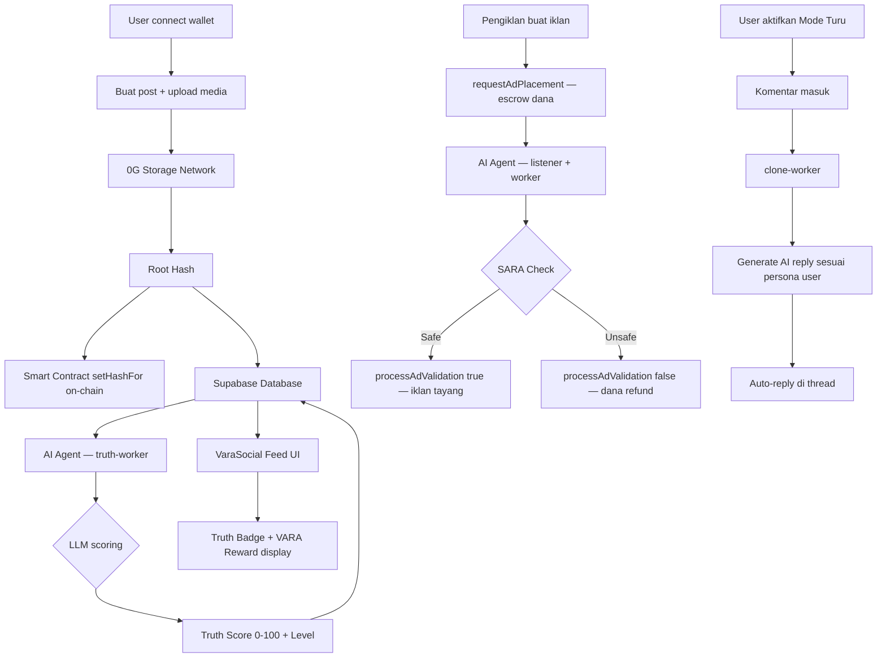

# VaraSocial

> **"Bukan siapa yang paling viral — tapi siapa yang paling jujur."**

VaraSocial adalah platform media sosial Web4 yang membalik insentif media sosial konvensional: setiap konten dinilai oleh AI secara real-time, kreator jujur mendapat reward $VARA, dan semua data media tersimpan permanen di [0G Decentralized Storage Network](https://0g.ai). Dibangun untuk **0G APAC Hackathon**.

**🌐 Live Demo:** [varasocial.vercel.app](https://varasocial.vercel.app/)
**📄 Smart Contract:** [`0x948F0ea80688E175d85D2B08418190AaB24db38d`](https://chainscan-galileo.0g.ai/address/0x948F0ea80688E175d85D2B08418190AaB24db38d) — 0G Chain Galileo Testnet (Chain ID `16602`)

---

## Mengapa VaraSocial?

Hoax menyebar **6× lebih cepat** dari fakta (MIT, 2018). Platform sosial Web2 memonetisasi engagement, bukan kebenaran — dan data pengguna sepenuhnya dikuasai korporat. VaraSocial membalik ini:

| Masalah Web2 | Solusi VaraSocial |
|---|---|
| Hoax viral tanpa filter | AI Truth Score 0–100 pada setiap post |
| Kreator kecil tidak dibayar adil | Reward $VARA otomatis untuk konten berkualitas tinggi |
| Data dikuasai platform | Media tersimpan di 0G Network, hash on-chain — milik pengguna |
| Iklan tanpa moderasi transparan | Escrow dana iklan di smart contract, cair hanya setelah AI approve |
| Identitas terpusat rentan | Wallet-first login — tidak ada email, tidak ada password |

---

## Screenshots

| Home Feed | Profile |
|-----------|---------|
|  |  |

| Monetize Dashboard | Ads Setup |
|--------------------|-----------|
|  |  |

---

## Fitur Utama

### 1. AI Truth Score — Real-time Content Validation
Setiap post yang dibuat langsung masuk ke antrian Redis dan diproses oleh `truth-worker`:
- Skor **0–100** dihitung via LLM (OpenRouter)
- Label **Verified** (70–100, hijau) · **Suspicious** (40–69, kuning) · **Hoax** (0–39, merah)
- Badge muncul langsung di feed — semua pengguna bisa melihat tingkat kebenaran konten

### 2. Mode Turu — AI Clone Persona
Fitur unik yang tidak ada di platform lain: ketika pengguna mengaktifkan Mode Turu, AI agent mengambil alih persona mereka dan **membalas komentar secara otomatis** berdasarkan konteks thread dan gaya bicara pengguna tersebut. Engagement tetap hidup 24/7 meski pengguna offline.

### 3. $VARA Reward — Insentif untuk Konten Berkualitas
Post dengan `truthScore ≥ 80` dan `viralityScore ≥ 60` secara otomatis mendapat kalkulasi reward $VARA yang ditampilkan real-time di feed dan dashboard monetisasi.

### 4. Iklan dengan Escrow On-chain + AI Moderasi SARA
Pengiklan menyetor dana ke smart contract (`requestAdPlacement()`) — dana **terkunci** sampai AI agent memvalidasi konten iklan bebas dari SARA/ujaran kebencian. Jika ditolak, dana otomatis di-refund. Transparan dan tidak bisa dimanipulasi.

### 5. 0G Storage + On-chain Data Ownership
Media pengguna diupload ke 0G Network. Root hash disimpan on-chain via `setHashFor()`. Pengguna bisa:
- `grantAccess / revokeAccess` — kontrol siapa yang bisa baca data mereka
- `claimOwnership()` — ambil alih pengelolaan data mereka sepenuhnya
- `withdrawExpired()` — self-refund jika operator tidak merespons dalam 24 jam

### 6. Wallet-First Identity
Login menggunakan EVM wallet (MetaMask, Coinbase Wallet, WalletConnect). Tidak ada email, tidak ada password — identitas digital yang benar-benar milik pengguna.

---

## Status Fitur

| Fitur | Status |
|-------|--------|
| Feed (For You / Following / Truth Verified) | ✅ Done |
| Compose post dengan optimistic update | ✅ Done |
| Like, repost, komentar | ✅ Done |
| Profil pengguna | ✅ Done |
| AI Truth Score badge (real-time via worker) | ✅ Done |
| Virality Score | ✅ Done |
| Wallet connect (RainbowKit + Wagmi) | ✅ Done |
| Smart contract `StorageGatekeeper` (deployed) | ✅ Done |
| AI agent: truth-worker, clone-worker, likes-worker | ✅ Done |
| Mode Turu (AI clone auto-reply) | ✅ Done |
| Ads dengan escrow on-chain + AI SARA check | ✅ Done |
| $VARA reward display | ✅ Done |
| Monetize dashboard | ✅ Done |
| 0G Storage upload integration | ⚠️ Tersedia di `og-storage-utils/`, integrasi penuh ke UI in progress |
| Direct messages (Supabase Realtime) | ⚠️ UI done, butuh Realtime subscription |
| Notifikasi live | ⚠️ UI done, butuh Supabase Realtime |

---

## Arsitektur Sistem

### Stack Teknologi

| Layer | Teknologi |
|-------|-----------|
| **Frontend** | Next.js 16 (App Router), Tailwind CSS v4 |
| **Database & Auth** | Supabase (PostgreSQL + Row Level Security) |
| **Wallet** | RainbowKit + Wagmi + viem |
| **Decentralized Storage** | 0G Storage Network |
| **Blockchain** | 0G Chain Galileo Testnet (Chain ID 16602) |
| **Smart Contract** | Solidity — `StorageGatekeeper.sol` (deployed) |
| **AI Agent** | Node.js, BullMQ, Redis, OpenRouter LLM |
| **Containerisasi** | Docker + Docker Compose |
| **State Management** | React Context + useCallback |

### Smart Contract — StorageGatekeeper

**Deployed:** [`0x948F0ea80688E175d85D2B08418190AaB24db38d`](https://chainscan-galileo.0g.ai/address/0x948F0ea80688E175d85D2B08418190AaB24db38d)
**Network:** 0G Chain Galileo Testnet · Chain ID `16602`
**Explorer:** [chainscan-galileo.0g.ai](https://chainscan-galileo.0g.ai/address/0x948F0ea80688E175d85D2B08418190AaB24db38d)

| Fungsi | Keterangan |
|--------|------------|
| `setHashFor(user, rootHash)` | Simpan root hash 0G Storage pengguna on-chain |
| `requestSubscription()` | User bayar escrow untuk verifikasi blue-check |
| `processValidation(user, approved)` | AI agent approve → dana ke treasury; reject → auto-refund |
| `requestAdPlacement(campaignId)` | Pengiklan escrow dana iklan |
| `processAdValidation(user, approved)` | AI moderasi SARA on-chain — reject = refund otomatis |
| `grantAccess / revokeAccess` | User kontrol akses data mereka |
| `claimOwnership()` | User ambil alih pengelolaan data sepenuhnya |
| `withdrawExpired()` | Self-refund jika operator tidak respons dalam 24 jam |

### AI Agent System — 4 Worker Paralel

```
┌─────────────────────────────────────────────────────────┐
│                    AI Validator Agent                     │
│                  (Docker · PM2 · Node.js)                │
├────────────────┬────────────────┬────────────────────────┤
│  truth-worker  │  clone-worker  │  listener + worker     │
│                │                │                        │
│ Post baru →    │ Komentar baru  │ Event 0G blockchain →  │
│ Redis queue →  │ → Redis queue  │ Redis queue →          │
│ LLM scoring    │ → AI generate  │ SARA check via LLM →   │
│ 0–100 →        │   reply sesuai │ approve/reject on-chain│
│ update DB      │   persona user │ + auto-refund          │
├────────────────┴────────────────┴────────────────────────┤
│                   likes-worker                           │
│   Deteksi milestone likes → trigger notifikasi reward    │
└─────────────────────────────────────────────────────────┘
```

### Alur Data Lengkap



---

## Quick Start

### Demo Cepat (hanya butuh Supabase)

```bash
git clone https://github.com/your-repo/varasocial
cd varasocial
npm install
cp .env.example .env.local
# Isi NEXT_PUBLIC_SUPABASE_URL, NEXT_PUBLIC_SUPABASE_ANON_KEY,
# NEXT_PUBLIC_DEMO_EMAIL, NEXT_PUBLIC_DEMO_PASSWORD
npx supabase db push
npx tsx scripts/seed.ts
npm run dev
```

Buka [http://localhost:3000](http://localhost:3000).

### Full Stack (termasuk AI Agent)

```bash
# 1. Setup frontend (lihat di atas)

# 2. Setup AI Agent
cd ai-agent/ai-validator
cp env.example .env
# Isi RPC_URL, CONTRACT_ADDRESS, OPERATOR_PRIVATE_KEY,
# SUPABASE_URL, SUPABASE_SERVICE_KEY, OPENROUTER_API_KEY, OG_INDEXER_RPC

# 3. Jalankan agent (Redis + semua worker)
docker-compose up -d
```

---

## Environment Variables

### Frontend (`/.env.local`)

| Variable | Wajib | Keterangan |
|----------|-------|------------|
| `NEXT_PUBLIC_SUPABASE_URL` | ✅ | Supabase project URL |
| `NEXT_PUBLIC_SUPABASE_ANON_KEY` | ✅ | Supabase anon key |
| `NEXT_PUBLIC_DEMO_EMAIL` | ✅ | Email seed user (auto-login) |
| `NEXT_PUBLIC_DEMO_PASSWORD` | ✅ | Password seed user |
| `NEXT_PUBLIC_WALLETCONNECT_PROJECT_ID` | ⚠️ | [cloud.walletconnect.com](https://cloud.walletconnect.com) |
| `NEXT_PUBLIC_0G_RPC_URL` | ⚠️ | 0G Storage node RPC endpoint |

### AI Agent (`/ai-agent/ai-validator/.env`)

| Variable | Keterangan |
|----------|------------|
| `RPC_URL` | 0G Chain RPC (untuk listen contract events) |
| `CONTRACT_ADDRESS` | `0x948F0ea80688E175d85D2B08418190AaB24db38d` |
| `OPERATOR_PRIVATE_KEY` | Hot wallet operator untuk on-chain tx |
| `SUPABASE_URL` + `SUPABASE_SERVICE_KEY` | Akses DB dari agent |
| `OPENROUTER_API_KEY` | LLM untuk truth scoring + SARA check |
| `OG_INDEXER_RPC` | 0G indexer untuk download konten |

---

## Struktur Project

```
app/
  (main)/             # Semua route terautentikasi
    page.tsx          # Home feed
    explore/          # Search & discovery
    profile/          # Profil pengguna aktif
    user/[handle]/    # Profil publik pengguna lain
    post/[id]/        # Single post + komentar
    messages/         # DMs
    notifications/    # Notifikasi
    mode-turu/        # Aktifkan AI clone persona
    monetize/         # Dashboard $VARA earnings
    ads/              # Setup kampanye iklan
    socialflow/       # Tren viral graph
    ai-filter/        # Filter feed by AI tag
components/
  feed/               # Feed, PostCard, ComposeBox
  layout/             # Sidebar, RightPanel, MobileNav
  common/             # Avatar, TruthBadge, VaraReward, ViralityScore
contracts/
  src/StorageGatekeeper.sol   # Smart contract (deployed)
  script/Deploy.s.sol         # Foundry deploy script
ai-agent/
  ai-validator/
    src/
      truth-worker.js   # AI truth scoring setiap post baru
      clone-worker.js   # AI auto-reply untuk Mode Turu
      likes-worker.js   # Deteksi milestone likes
      listener.js       # Listen event 0G blockchain
      worker.js         # Proses SARA check + on-chain tx
      ai.js             # OpenRouter LLM wrapper (retry + timeout)
og-storage-utils/       # 0G Storage upload/download utilities
lib/
  store.tsx             # Global React context (state + actions)
  supabase-queries.ts   # DB query helpers
  types.ts              # TypeScript interfaces
supabase/
  migrations/           # 11 SQL migration files
```

---

## Database Schema

| Tabel | Keterangan |
|-------|------------|
| `users` | handle, displayName, avatar, walletAddress, bio, verified, is_turu |
| `posts` | content, media, truthScore, truthLevel, viralityScore, varaReward |
| `likes` | userId × postId |
| `reposts` | userId × postId |
| `comments` | postId, authorId, content |
| `messages` | senderId, receiverId, text |
| `notifications` | type (like/repost/reply/follow/reward), actorId, targetUserId |
| `monetization` | userId, earnings, payouts |
| `ad_campaigns` | campaignId (bytes32 on-chain), status, content |

---

## Roadmap

- [ ] Integrasi penuh Vara Network — distribusi $VARA on-chain langsung ke wallet kreator
- [ ] Supabase Realtime — live feed, DMs, dan notifikasi push
- [ ] Mobile-first PWA
- [ ] DAO governance untuk parameter Truth Score threshold
- [ ] ZK proof untuk verifikasi kebenaran tanpa membuka konten privat

---

## Team

Dibangun selama **0G APAC Hackathon** oleh:

| Nama | Peran |
|------|-------|
| **Rafi Mahrus** | Fullstack (Frontend, Smart Contract, AI Agent) |
| **Rakya Vara** | Fullstack (Frontend, Backend, Infrastructure) |

---

## Lisensi

MIT
