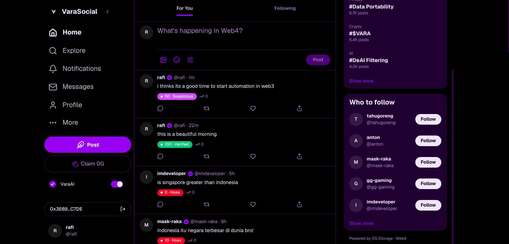
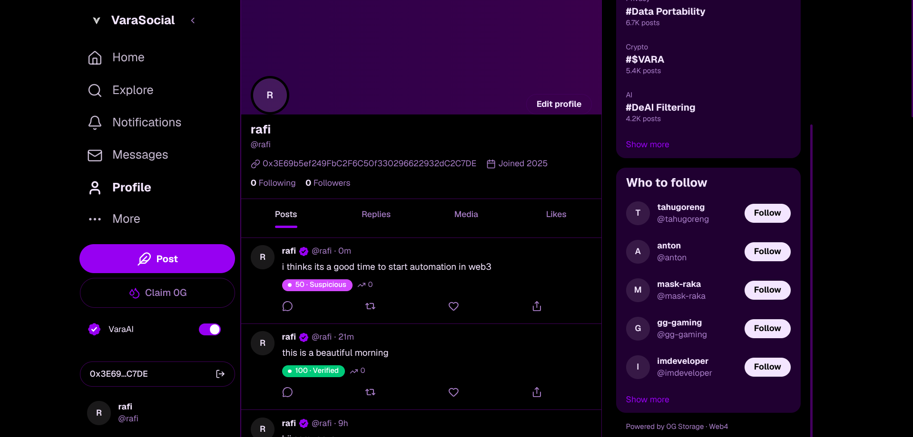
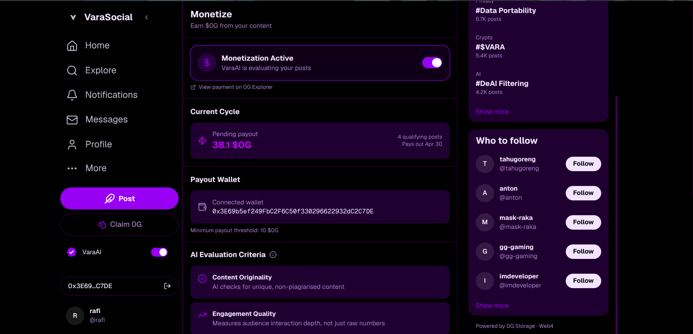
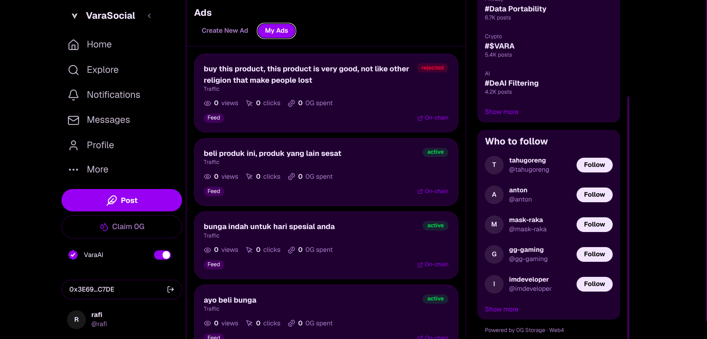
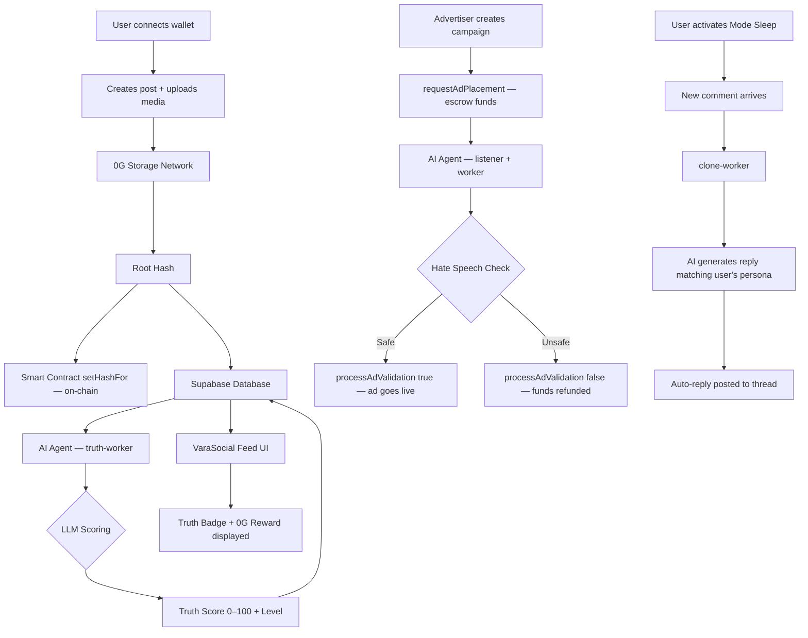

# VaraSocial

> **"It's not who goes viral the most — it's who is the most honest."**

VaraSocial is a **Web4 social media platform** that fundamentally reverses the broken incentives of conventional social networks. Every piece of content is scored by AI in real time, honest creators earn `$0G` rewards, and all media is stored permanently on the [0G Decentralized Storage Network](https://0g.ai). Built for the **0G APAC Hackathon**.

**🌐 Live Demo:** [varasocial.vercel.app](https://varasocial.vercel.app/)
**📄 Smart Contract:** [`0x948F0ea80688E175d85D2B08418190AaB24db38d`](https://chainscan-galileo.0g.ai/address/0x948F0ea80688E175d85D2B08418190AaB24db38d) — 0G Chain Galileo Testnet (Chain ID `16602`)

---

## Why VaraSocial?

Misinformation spreads **6× faster** than facts *(MIT, 2018)*. Web2 social platforms monetize engagement, not truth — and user data is entirely owned by corporations. VaraSocial flips this paradigm:

| Web2 Problem | VaraSocial Solution |
|---|---|
| Misinformation goes viral without any filter | AI Truth Score (0–100) applied to every post |
| Small creators are not fairly compensated | Automatic `$0G` rewards for high-quality, truthful content |
| Platforms own your data | Media stored on 0G Network with on-chain hash — owned by the user |
| Ads with no transparent moderation | Ad funds escrowed in a smart contract, released only after AI approval |
| Centralized identity is a single point of failure | Wallet-first login — no email, no password |

---

## Screenshots

| Home Feed | Profile |
|-----------|---------|
|  |  |

| Monetize Dashboard | Ads Setup |
|--------------------|-----------|
|  |  |

---

## Core Features

### 1. AI Truth Score — Real-Time Content Validation
Every new post is instantly pushed into a Redis queue and processed by the `truth-worker`:
- A score from **0–100** is computed via LLM (OpenRouter)
- **Verified** (70–100, green) · **Suspicious** (40–69, yellow) · **Hoax** (0–39, red)
- The badge appears immediately in the feed — every user sees the credibility of every post at a glance

### 2. Mode Sleep — AI Clone Persona
A feature that doesn't exist anywhere else: when a user activates **Mode Sleep**, an AI agent takes over their persona and **automatically replies to comments** based on the thread context and the user's own writing style. Your engagement stays alive 24/7 — even when you're offline.

### 3. $0G Rewards — Incentives for Quality Content
Posts with `truthScore ≥ 80` and `viralityScore ≥ 60` automatically receive a `$0G` reward calculation, displayed in real time on the feed and the monetization dashboard.

### 4. On-Chain Ad Escrow + AI Hate Speech Moderation
Advertisers deposit funds into the smart contract via `requestAdPlacement()` — funds are **locked** until the AI agent validates that the ad content is free of hate speech and harmful material. If rejected, funds are automatically refunded. Fully transparent and tamper-proof.

### 5. 0G Storage + On-Chain Data Ownership
User media is uploaded to the 0G Network. The root hash is anchored on-chain via `setHashFor()`. Users have full control:
- `grantAccess / revokeAccess` — decide who can read their data
- `claimOwnership()` — take full self-custody of their data
- `withdrawExpired()` — self-refund if the operator fails to respond within 24 hours

### 6. Wallet-First Identity
Log in with any EVM-compatible wallet (MetaMask, Coinbase Wallet, WalletConnect). No email, no password — a truly self-sovereign digital identity.

---

## Feature Status

| Feature | Status |
|---------|--------|
| Feed (For You / Following / Truth Verified tabs) | ✅ Done |
| Compose post with optimistic update | ✅ Done |
| Like, repost, comment | ✅ Done |
| User profile | ✅ Done |
| AI Truth Score badge (real-time via worker) | ✅ Done |
| Virality Score | ✅ Done |
| Wallet connect (RainbowKit + Wagmi) | ✅ Done |
| `StorageGatekeeper` smart contract (deployed) | ✅ Done |
| AI agents: truth-worker, clone-worker, likes-worker | ✅ Done |
| Mode Sleep (AI clone auto-reply) | ✅ Done |
| Ads with on-chain escrow + AI moderation | ✅ Done |
| `$0G` reward display | ✅ Done |
| Monetize dashboard | ✅ Done |
| 0G Storage upload integration | ⚠️ Utilities available in `og-storage-utils/`; full UI integration in progress |
| Direct messages (Supabase Realtime) | ⚠️ UI complete; Realtime subscription pending |
| Live notifications | ⚠️ UI complete; Supabase Realtime pending |

---

## System Architecture

### Technology Stack

| Layer | Technology |
|-------|------------|
| **Frontend** | Next.js 16 (App Router), Tailwind CSS v4 |
| **Database & Auth** | Supabase (PostgreSQL + Row Level Security) |
| **Wallet** | RainbowKit + Wagmi + viem |
| **Decentralized Storage** | 0G Storage Network |
| **Blockchain** | 0G Chain Galileo Testnet (Chain ID 16602) |
| **Smart Contract** | Solidity — `StorageGatekeeper.sol` (deployed) |
| **AI Agent** | Node.js, BullMQ, Redis, OpenRouter LLM |
| **Containerization** | Docker + Docker Compose |
| **State Management** | React Context + useCallback |

### Smart Contract — StorageGatekeeper

**Deployed:** [`0x948F0ea80688E175d85D2B08418190AaB24db38d`](https://chainscan-galileo.0g.ai/address/0x948F0ea80688E175d85D2B08418190AaB24db38d)
**Network:** 0G Chain Galileo Testnet · Chain ID `16602`
**Explorer:** [chainscan-galileo.0g.ai](https://chainscan-galileo.0g.ai/address/0x948F0ea80688E175d85D2B08418190AaB24db38d)

| Function | Description |
|----------|-------------|
| `setHashFor(user, rootHash)` | Anchor the user's 0G Storage root hash on-chain |
| `requestSubscription()` | User escrows funds for blue-check verification |
| `processValidation(user, approved)` | AI approves → funds released to treasury; rejects → auto-refund |
| `requestAdPlacement(campaignId)` | Advertiser escrows ad campaign funds |
| `processAdValidation(user, approved)` | On-chain AI moderation — reject triggers automatic refund |
| `grantAccess / revokeAccess` | User manages read permissions on their data |
| `claimOwnership()` | User takes full self-custody of their stored data |
| `withdrawExpired()` | Self-refund if operator is unresponsive within 24 hours |

### AI Agent System — 4 Parallel Workers

```
┌─────────────────────────────────────────────────────────┐
│                    AI Validator Agent                    │
│                  (Docker · PM2 · Node.js)                │
├────────────────┬────────────────┬────────────────────────┤
│  truth-worker  │  clone-worker  │  listener + worker     │
│                │                │                        │
│ New post →     │ New comment →  │ 0G blockchain event →  │
│ Redis queue →  │ Redis queue →  │ Redis queue →          │
│ LLM scoring    │ AI generates   │ Hate speech check →    │
│ 0–100 →        │ reply matching │ approve/reject on-chain│
│ update DB      │ user's persona │ + auto-refund          │
├────────────────┴────────────────┴────────────────────────┤
│                      likes-worker                        │
│      Detects like milestones → triggers reward alerts    │
└─────────────────────────────────────────────────────────┘
```

### Full Data Flow



---

## Quick Start

### Quick Demo (Supabase only)

```bash
git clone https://github.com/your-repo/varasocial
cd varasocial
npm install
cp .env.example .env.local
# Fill in: NEXT_PUBLIC_SUPABASE_URL, NEXT_PUBLIC_SUPABASE_ANON_KEY,
#          NEXT_PUBLIC_DEMO_EMAIL, NEXT_PUBLIC_DEMO_PASSWORD
npx supabase db push
npx tsx scripts/seed.ts
npm run dev
```

Open [http://localhost:3000](http://localhost:3000).

### Full Stack (including AI Agent)

```bash
# 1. Set up the frontend (see above)

# 2. Set up the AI Agent
cd ai-agent/ai-validator
cp env.example .env
# Fill in: RPC_URL, CONTRACT_ADDRESS, OPERATOR_PRIVATE_KEY,
#          SUPABASE_URL, SUPABASE_SERVICE_KEY, OPENROUTER_API_KEY, OG_INDEXER_RPC

# 3. Start the agent (Redis + all workers)
docker-compose up -d
```

---

## Environment Variables

### Frontend (`/.env.local`)

| Variable | Required | Description |
|----------|----------|-------------|
| `NEXT_PUBLIC_SUPABASE_URL` | ✅ | Supabase project URL |
| `NEXT_PUBLIC_SUPABASE_ANON_KEY` | ✅ | Supabase anon key |
| `NEXT_PUBLIC_DEMO_EMAIL` | ✅ | Seed user email (auto-login for demo) |
| `NEXT_PUBLIC_DEMO_PASSWORD` | ✅ | Seed user password |
| `NEXT_PUBLIC_WALLETCONNECT_PROJECT_ID` | ⚠️ | Obtain at [cloud.walletconnect.com](https://cloud.walletconnect.com) |
| `NEXT_PUBLIC_0G_RPC_URL` | ⚠️ | 0G Storage node RPC endpoint |

### AI Agent (`/ai-agent/ai-validator/.env`)

| Variable | Description |
|----------|-------------|
| `RPC_URL` | 0G Chain RPC URL (for listening to contract events) |
| `CONTRACT_ADDRESS` | `0x948F0ea80688E175d85D2B08418190AaB24db38d` |
| `OPERATOR_PRIVATE_KEY` | Operator hot wallet for on-chain transactions |
| `SUPABASE_URL` + `SUPABASE_SERVICE_KEY` | Database access from the agent |
| `OPENROUTER_API_KEY` | LLM for truth scoring and hate speech checks |
| `OG_INDEXER_RPC` | 0G indexer for downloading content |

---

## Project Structure

```
app/
  (main)/             # All authenticated routes
    page.tsx          # Home feed
    explore/          # Search & discovery
    profile/          # Active user's profile
    user/[handle]/    # Public profile of other users
    post/[id]/        # Single post + comments thread
    messages/         # Direct messages
    notifications/    # Notifications center
    mode-sleep/       # Activate AI clone persona
    monetize/         # $0G earnings dashboard
    ads/              # Ad campaign setup
    socialflow/       # Viral trend graph
    ai-filter/        # Filter feed by AI truth tag
components/
  feed/               # Feed, PostCard, ComposeBox
  layout/             # Sidebar, RightPanel, MobileNav
  common/             # Avatar, TruthBadge, 0G Reward, ViralityScore
contracts/
  src/StorageGatekeeper.sol   # Deployed smart contract
  script/Deploy.s.sol         # Foundry deploy script
ai-agent/
  ai-validator/
    src/
      truth-worker.js   # AI truth scoring for every new post
      clone-worker.js   # AI auto-reply for Mode Sleep
      likes-worker.js   # Detects like milestones for rewards
      listener.js       # Listens to 0G blockchain events
      worker.js         # Processes hate speech checks + on-chain txs
      ai.js             # OpenRouter LLM wrapper (with retry + timeout)
og-storage-utils/       # 0G Storage upload/download utilities
lib/
  store.tsx             # Global React context (state + actions)
  supabase-queries.ts   # Database query helpers
  types.ts              # TypeScript interfaces
supabase/
  migrations/           # 11 SQL migration files
```

---

## Database Schema

| Table | Description |
|-------|-------------|
| `users` | handle, displayName, avatar, walletAddress, bio, verified, is_turu |
| `posts` | content, media, truthScore, truthLevel, viralityScore, varaReward |
| `likes` | userId × postId |
| `reposts` | userId × postId |
| `comments` | postId, authorId, content |
| `messages` | senderId, receiverId, text |
| `notifications` | type (like/repost/reply/follow/reward), actorId, targetUserId |
| `monetization` | userId, earnings, payouts |
| `ad_campaigns` | campaignId (bytes32 on-chain), status, content |

---

## Roadmap

- [ ] Full 0G Network integration — on-chain `$0G` distribution directly to creator wallets
- [ ] Supabase Realtime — live feed updates, DMs, and push notifications
- [ ] Mobile-first PWA
- [ ] DAO governance for Truth Score threshold parameters
- [ ] ZK proofs for truth verification without exposing private content

---

## Team

Built during the **0G APAC Hackathon** by:

| Name | Role |
|------|------|
| **Rafi Mahrus** | Fullstack (Frontend, Smart Contract, AI Agent) |
| **Rakyavara** | Fullstack (Frontend, Backend, Infrastructure) |

---

## License

MIT
